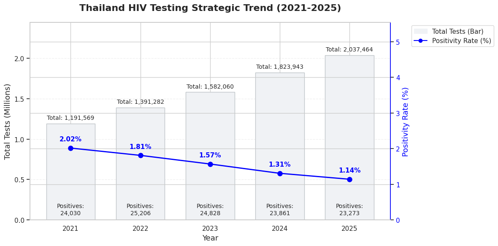
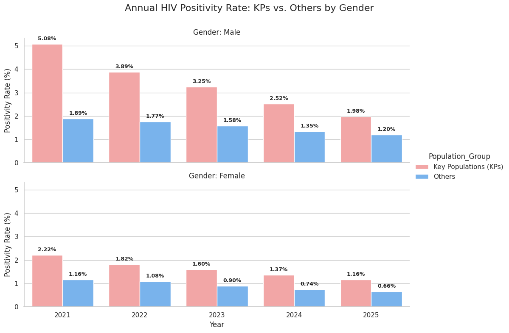
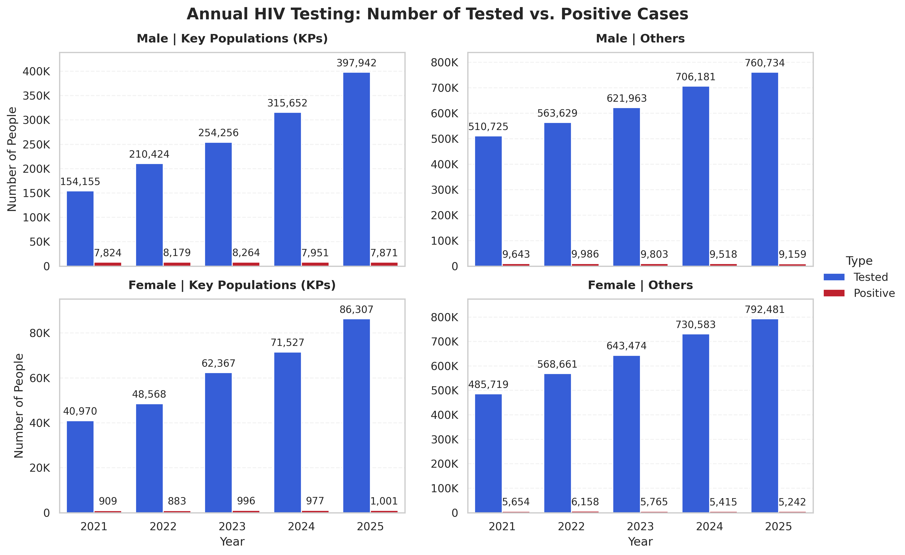
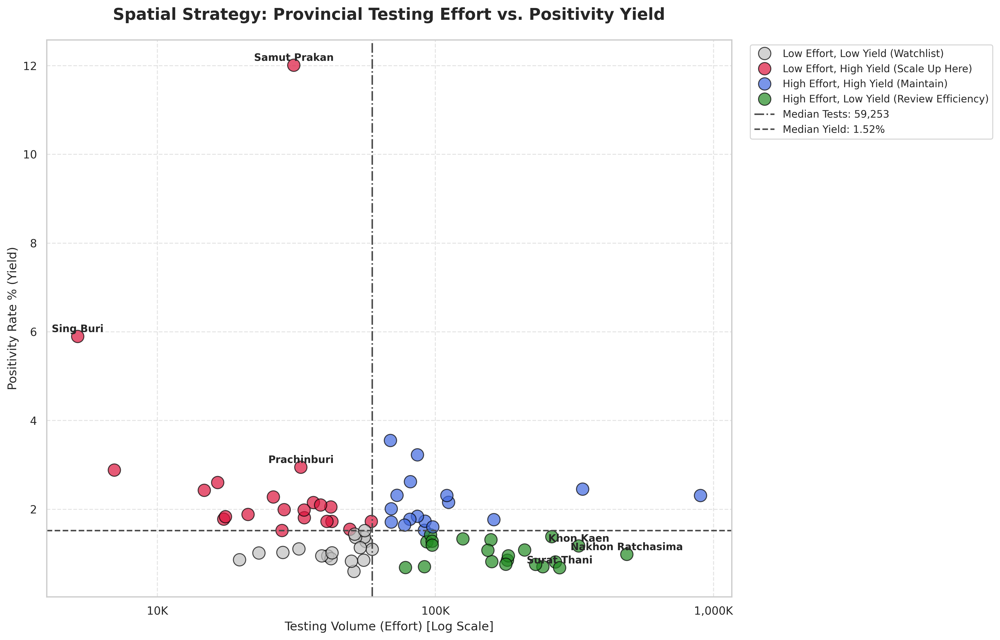
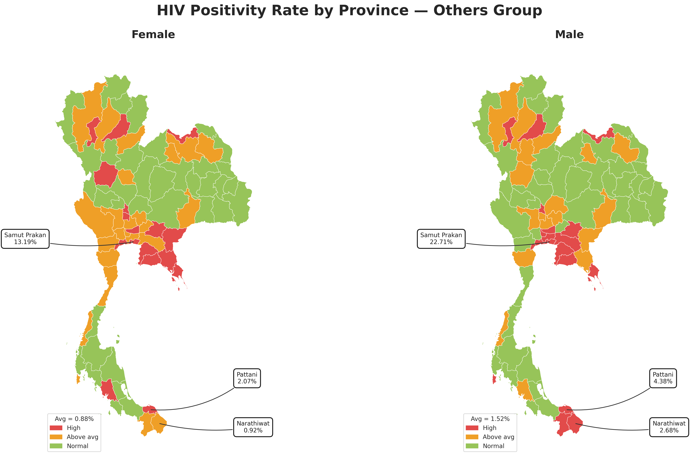
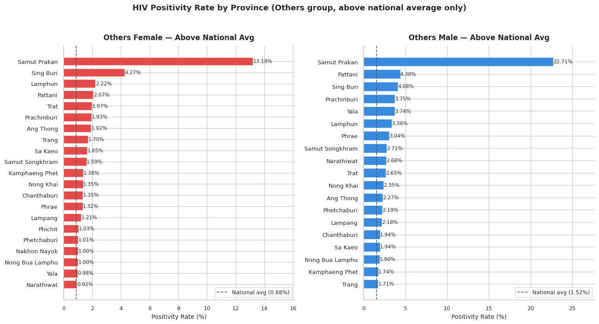

# การวิเคราะห์กลยุทธ์เพื่อเจาะลึกประสิทธิภาพการจัดการ HIV ของประเทศไทย (2021-2025): เมื่อ “ปริมาณ” อาจไม่ใช่คำตอบของ “ประสิทธิภาพ"
<b>แหล่งข้อมูล:</b> <a href="https://hivhub.ddc.moph.go.th/datamart/">คลังข้อมูลจากระบบสารสนเทศ HIV (HIV Hub Thailand) กรมควบคุมโรค</a>
  

เป้าหมายหลักของยุทธศาสตร์การยุติปัญหาเอดส์ (Ending AIDS) ของประเทศไทยไม่ใช่เพียงแค่การรักษา แต่คือการ "ค้นหา" ผู้ติดเชื้อรายใหม่ให้พบเร็วที่สุด เพื่อนำเข้าสู่กระบวนการรักษาและป้องกันการแพร่ระบาด อย่างไรก็ตาม เมื่อเรากางข้อมูลสถิติย้อนหลัง 5 ปี (2021-2025) สิ่งที่ข้อมูลบอกเราไม่ใช่เพียงแค่ตัวเลขที่เพิ่มขึ้นหรือลดลง แต่มันคือ "Efficiency Gap" หรือช่องว่างของประสิทธิภาพที่สะท้อนว่า เราอาจกำลังใช้ทรัพยากรมหาศาลไปกับการค้นหาที่ "ผิดจุด"  

บทความนี้จะพาไปเจาะลึกผ่านมุมมองของข้อมูล เพื่อวิเคราะห์ว่าท่ามกลางการตรวจนับล้านครั้งต่อปี เราพลาดอะไรไป และกลุ่มประชากรแฝง (Hidden Population) ซ่อนตัวอยู่ที่ไหน  
---
## 1. กับดักของตัวเลข: ปริมาณการตรวจที่เพิ่มขึ้น vs อัตราการพบเชื้อที่ดิ่งลง  
  

<b>แผนภูมิที่ 1: แนวโน้มยุทธศาสตร์ระดับประเทศ (Strategic Trend)</b>

จากแผนภูมิที่ 1 เราจะเห็นภาพการเติบโตของปริมาณการตรวจหาเชื้อที่น่าประทับใจ ในปี 2021 ประเทศไทยมีการตรวจหาเชื้อ HIV ประมาณ 1.19 ล้านครั้ง แต่ภายในปี 2025 ตัวเลขนี้พุ่งสูงขึ้นถึง 2.03 ล้านครั้ง หรือเพิ่มขึ้นเกือบ 70% ภายในระยะเวลาเพียง 5 ปี ในทางตรงกันข้ามกันอัตราการติดเชื้อ (Positivity Rate) กลับลดลงอย่างต่อเนื่องจาก 2.02% ในปี 2021 เหลือเพียง 1.14% ในปี 2025
หากพิจารณาแค่ "ตัวเลขโดยรวม" เราอาจจะภูมิใจที่สามารถตรวจคนได้เพิ่มขึ้นเกือบเท่าตัว ในขณะที่จำนวนผู้ติดเชื้อที่ตรวจพบในแต่ละปีอยู่ที่ประมาณ 23,000 - 25,000 ราย ซึ่งอาจสะท้อนให้เห็นว่าการเพิ่มจำนวนการตรวจในกลุ่มประชากรที่ “ไม่มีความเสี่ยง” จะทำให้อัตราการติดเชื้อลดต่ำลงเรื่อย ๆ จนดูเหมือนสถานการณ์ดีขึ้น แต่เราต้อง “ออกแรง” ตรวจเพิ่มขึ้นจาก 1 ล้าน เป็น 2 ล้านครั้งเพื่อให้ได้ผลลัพธ์เท่าเดิม นั่นหมายความว่าต้นทุนต่อการค้นพบผู้ติดเชื้อ 1 ราย (Cost per Case Found) กำลังพุ่งสูงขึ้นเรื่อย ๆ นี่คือสัญญาณเตือนว่ากลยุทธ์การตรวจแบบวงกว้าง "Mass Testing" อาจเริ่มถึงทางตันทั้ง ๆ ที่เป้าหมายหลักคือการหา "คนติดเชื้อ" ไม่ใช่หา "คนไม่ติดเชื้อ" ซึ่งทำให้เกิดคำถามสำคัญว่า "เรากำลังให้ความสำคัญกับการตรวจกลุ่มประชากรที่ความเสี่ยงต่ำเกินไปหรือไม่?"

ข้อมูลในส่วนถัดไปจะเริ่มไขคำตอบว่า ทำไมเราถึงต้องใช้ความพยายามขนาดนี้เพียงเพื่อรักษาตัวเลขผู้ติดเชื้อให้คงเดิม
---
## 2. กลุ่มประชากรแฝง: ภายใต้หน้ากากของ "กลุ่มประชากรทั่วไป"  
หนึ่งในประเด็นที่น่าสนใจที่สุดจากการวิเคราะห์คือ การเปรียบเทียบระหว่าง กลุ่มประชากรหลัก (Key Populations - KPs) เช่น กลุ่มชายที่มีเพศสัมพันธ์กับชาย คนทำงานบริการ และผู้ที่ฉีดสารเสพติด กับ กลุ่มประชากรทั่วไป (Others)

### 2.1 สัดส่วนที่คงที่อย่างน่าประหลาด
  

<b>แผนภูมิที่ 2: แนวโน้มสัดส่วนผู้ติดเชื้อ HIV จำแนกตามปี</b>

เมื่อดูสัดส่วนผู้ติดเชื้อรายปี (Annual Proportion) พบว่ากลุ่มกลุ่มประชากรหลัก (KPs) ครองสัดส่วนผู้ติดเชื้ออยู่ที่ประมาณ 36-38% ขณะที่กลุ่มประชากรทั่วไป (Others) กลับครองสัดส่วนสูงถึง 62-64% ซึ่งสัดส่วนนี้แทบจะไม่มีการเปลี่ยนแปลงเลยตลอด 5 ปี  

ทำไมถึงเป็นเช่นนั้น? มีความเป็นไปได้ 2 ทาง:  
1. การระบาดได้กระจายตัวเข้าสู่ประชากรทั่วไปอย่างเต็มตัวแล้ว
2. มีกลุ่มคนที่มีพฤติกรรมเสี่ยง (KPs) จำนวนมากที่ไม่เปิดเผยตัวตน (Undisclosed) และถูกจัดกลุ่มให้อยู่ในกลุ่ม "ประชากรทั่วไป" โดยไม่ตั้งใจ

### 2.2 อัตราการติดเชื้อแยกตามเพศ: ร่องรอยที่ปรากฏในข้อมูล  
  

<b>แผนภูมิที่ 3: การเปรียบเทียบอัตราการติดเชื้อ HIV จำแนกตามกลุ่มเพศ</b>

ผลลัพธ์ที่สะท้อนความหนาแน่นของการแพร่ระบาดในแต่ละกลุ่มประชากร:
 - กลุ่มประชากรหลักเพศชาย (Male KPs) ในฐานะกลุ่มเป้าหมายเชิงยุทธศาสตร์:
ข้อมูลระบุชัดเจนว่าอัตราผลการตรวจเป็นบวก (Positivity Rate) ในกลุ่มประชากรหลักเพศชายนั้น สูงกว่ากลุ่มประชากรอื่นอย่างมีนัยสำคัญ แม้สถิติจะมีการปรับตัวลดลงจาก 5.08% สู่ 1.98% แต่ยังคงเป็นกลุ่มเดียวที่มีสัดส่วนเข้าใกล้ระดับ 2% ซึ่งสะท้อนให้เห็นถึงภาวะการกระจุกตัวของเชื้อที่ยังคงความเข้มข้นสูงสุดในประชากรกลุ่มนี้
 - เพศหญิงกับภาวะความเสี่ยงในจุดอับสายตา:
ในขณะที่กลุ่มประชากรเพศหญิง ทั้งในส่วนของกลุ่มประชากรหลัก (KPs) และกลุ่มประชากรทั่วไป (Others) มีอัตราผลการตรวจเป็นบวกต่ำกว่าระดับ 2% อย่างต่อเนื่อง โดยในปี 2025 สถิติของทั้งสองกลุ่มมีความใกล้เคียงกันอย่างมาก (1.16% และ 0.66% ตามลำดับ)
 - นัยสำคัญที่ปรากฏจากข้อมูล (Key Findings):
หลักฐานเชิงประจักษ์จากแผนภูมิแสดงให้เห็นว่า "ขอบเขตความเสี่ยงในเพศหญิงเริ่มมีความคลุมเครือ" เนื่องจากส่วนต่างของอัตราการติดเชื้อระหว่างกลุ่มเสี่ยงและกลุ่มประชากรทั่วไปในเพศหญิงนั้นแคบลงอย่างมากเมื่อเทียบกับเพศชาย ซึ่งอาจบ่งชี้ถึงการแพร่กระจายของเชื้อที่ขยายตัวออกไปนอกกลุ่มเป้าหมายหลักเดิม

  

<b>แผนภูมิที่ 4: แนวโน้มอัตราการตรวจพบเชื้อ HIV รายปี แยกตามกลุ่มประชากรและเพศ</b>

ปริมาณการตรวจเพิ่มขึ้น แต่จำนวนผู้ติดเชื้อค่อนข้างคงที่หรือลดลง (Testing vs Positive):  
 - ประสิทธิภาพของการตรวจแบบวงกว้างในเพศชาย: เราจะเห็น "แท่งสีฟ้า" (Tested) ในฝั่งผู้ชายทั้งสองกลุ่มพุ่งสูงขึ้นอย่างมหาศาล โดยเฉพาะกลุ่มประชากรทั่วไปในเพศชาย (Male Others) ที่เพิ่มขึ้นปีละนับแสนรายแต่เมื่อเทียบกับจำนวนคนติดเชื้อกลับเท่าเดิม สิ่งนี้แสดงให้เห็นว่าการตรวจแบบวงกว้าง (Mass Testing) นั้นอาจจะเป็นวิธีการเพิ่มงานโดยไม่จำเป็น
 - ช่องว่างของข้อมูลในเพศหญิง: ในขณะที่ปริมาณการตรวจในกลุ่มประชากรหลักในเพศหญิง (Female KPs) เพิ่มขึ้นแบบ "ค่อยเป็นค่อยไป" มากที่สุดเมื่อเทียบกับกลุ่มอื่น (จาก 4 หมื่น เป็น 8.6 หมื่น) ซึ่งถือเป็นสัดส่วนที่น้อยมากเมื่อเทียบกับปริมาณกลุ่มประชากรทั่วไปในเพศหญิง (Female Others) ที่มีจำนวนการตรวจเกือบ 8 แสนราย

จากการพิจารณาข้อมูลจากแผนภูมิที่ 4 ความสำเร็จในการลดอัตราผลการตรวจเป็นบวกในเพศชาย (ดังที่ปรากฏในแผนภูมิที่ 1) เป็นผลมาจากการดำเนินนโยบายเชิงรุกที่มุ่งเน้นกลุ่มเป้าหมายได้อย่างแม่นยำ อย่างไรก็ตาม ในทางตรงกันข้าม พบว่ายังมีข้อจำกัดในการเข้าถึงกลุ่มประชากรหลักเพศหญิง (Female KPs) ซึ่งอาจส่งผลให้สถิติการติดเชื้อที่ลดลงในแผนภูมิที่ 1 ของเพศหญิงนั้น ไม่ได้สะท้อนสถานการณ์ที่แท้จริงทั้งหมด แต่เป็นผลมาจากภาวะการตรวจพบที่ไม่ครอบคลุมกลุ่มเสี่ยง (Under-detection)

สำหรับแนวทางการบริหารจัดการในกลุ่มประชากรทั่วไปเพศหญิง (Female Others) ข้อมูลชี้ให้เห็นว่าการขยายปริมาณการตรวจ (Quantity) อาจไม่ก่อให้เกิดความคุ้มค่าเชิงสถิติ เนื่องจากมีสัดส่วนผลเป็นบวกต่ำมากเมื่อเทียบกับจำนวนการตรวจเกือบ 8 แสนราย ดังนั้น ยุทธศาสตร์ในระยะถัดไปควรปรับเปลี่ยนจากการตรวจแบบวงกว้าง (Mass Testing) ไปสู่ "การคัดกรองเชิงกลยุทธ์" (Selective Screening) โดยมุ่งเน้นการระบุตัวตนกลุ่มที่มีความเสี่ยงแฝง (Hidden Risk) ภายในกลุ่มประชากรทั่วไป เพื่อลดภาระการดำเนินงานของระบบสาธารณสุข และยกระดับประสิทธิภาพในการค้นหาผู้ติดเชื้อ (Case Finding) ให้มีความแม่นยำสูงสุด
---
## 3. กลยุทธ์เชิงพื้นที่: การบริหารทรัพยากรแบบ "Targeted Approach"  
เมื่อทรัพยากรมีจำกัด เราไม่สามารถตรวจแบบวงกว้างได้เท่ากันทุกจังหวัด ข้อมูลชุด "Spatial Strategy" ช่วยให้เราแบ่งกลุ่มจังหวัดตามความคุ้มค่า (Effort vs Yield) เพื่อการจัดสรรงบประมาณใหม่  

  

<b>แผนภูมิที่ 5: การวิเคราะห์ความสัมพันธ์ระหว่างปริมาณการตรวจและอัตราผลบวกเชื้อ HIV รายจังหวัด</b>

จากการวิเคราะห์แผนภูมิที่ 5 เราสามารถจำแนกจังหวัดต่าง ๆ ออกเป็น 4 กลุ่ม (Quadrants) ตามความสัมพันธ์ระหว่าง ปริมาณการตรวจ (Testing Volume) และ อัตราการพบเชื้อ (Positivity Rate) เพื่อกำหนดแนวทางการรับมือที่เหมาะสม ดังนี้  
 - กลุ่มสีเทา (Watchlist): ตรวจน้อยและพบเชื้อน้อย ต้องเฝ้าระวังเพื่อป้องกันการระบาดในอนาคต
 - กลุ่มสีแดง (Scale Up): ตรวจน้อยแต่พบเชื้อสูง เป็นจุดวิกฤตที่ต้องรีบเพิ่มกำลังการตรวจ
 - กลุ่มสีน้ำเงิน (Maintain): ตรวจมากและพบเชื้อสูง ระบบทำงานหนักและต้องรักษามาตรฐานไว้
 - กลุ่มสีเขียว (Review Efficiency): ตรวจมากแต่พบเชื้อน้อย ควรทบทวนความคุ้มค่าของการใช้ทรัพยากร  

อย่างไรก็ตาม เพื่อให้เกิดการบริหารจัดการที่มีประสิทธิภาพสูงสุด บทความนี้จะขอเจาะลึกไปที่กลุ่มสีแดงและกลุ่มสีเขียว ซึ่งเป็นกุญแจสำคัญในการปรับสมดุลการจัดสรรทรัพยากรสาธารณสุข

### 3.1 กลุ่ม Scale Up (Low Effort, High Yield)
  

<b>ตารางที่ 1: 10 อันดับจังหวัดที่ควรขยายผลการดำเนินงาน</b>

นี่คือกลุ่มจังหวัดที่เป็น "จุดยุทธศาสตร์" เพราะใช้ปริมาณการตรวจน้อยแต่กลับพบผู้ติดเชื้อในสัดส่วนที่สูงมาก (High Yield)
 - สมุทรปราการ ถือเป็นจังหวัดที่ควรให้ความสำคัญเพราะมีอัตราการตรวจพบเชื้อสูงถึง 12.01% (ค่าเฉลี่ยประเทศคือ 1.52%) ขณะที่มีปริมาณในการตรวจหาเชื้อเพียง 3 หมื่นรายเท่านั้น
 - สิงห์บุรี และ ปราจีนบุรี เป็นอีก 2 จังหวัดที่มีอัตราการตรวจพบเชื้อสูงถึง 5.90% และ 2.95% ตามลำดับ  

<b>ข้อเสนอแนะ:</b> จังหวัดเหล่านี้ควรได้รับงบประมาณสนับสนุนเพื่อ "ขยาย" การตรวจให้มากขึ้น เพราะทุก ๆ การตรวจที่เพิ่มขึ้น มีโอกาสสูงมากที่จะเจอผู้ติดเชื้อรายใหม่
### 3.2 กลุ่ม Review Efficiency (High Effort, Low Yield)
  

<b>ตารางที่ 2: 10 อันดับจังหวัดที่ควรทบทวนประสิทธิภาพ</b>

ในทางตรงกันข้าม จังหวัดเหล่านี้มีจำนวนการตรวจหาเชื้อสูงมาก แต่อัตราการตรวจพบเชื้อกลับต่ำกว่าที่ควรจะเป็น
 - นครราชสีมา ตรวจไปเกือบ 5 แสนราย แต่พบเชื้อเพียง 0.98%
 - ขอนแก่น และ สุราษฎร์ธานี มีปริมาณการตรวจ 2-3 แสนราย แต่อัตราการพบเชื้อต่ำกว่า 1.2%  

<b>ข้อเสนอแนะ:</b> จังหวัดเหล่านี้ควร "ทบทวน" กลยุทธ์การตรวจ ควรเลิกการตรวจแบบวงกว้างในกลุ่มประชากรทั่วไปที่มีความเสี่ยงต่ำ แล้วโยกย้ายทรัพยากรทั้งบุคลากรและชุดตรวจไปสนับสนุนจังหวัดในกลุ่ม Scale Up แทน
---
## 4. การวิเคราะห์ข้อมูลประชากรควบคู่กับข้อมูลเชิงพื้นที่ — ปฏิบัติการค้นหา "กลุ่มประชากรแฝง" ผ่าน Geospatial Intelligence  
เมื่อเราทราบแล้วว่าผู้ติดเชื้อกว่า 60% ถูกจัดอยู่ในกลุ่ม "ประชากรทั่วไป" คำถามลำดับถัดมาที่นักวิเคราะห์ต้องตอบให้ได้คือ "แล้วคนกลุ่มนี้อยู่ที่ไหน?" หากเรามองเพียงสถิติตัวเลขในตาราง เราอาจเห็นเพียงค่าเฉลี่ยที่ดูนิ่งสงบ แต่เมื่อเรานำข้อมูลเหล่านั้นมาวางลงบนแผนที่ประเทศไทย (ดังแผนภูมิด้านล่าง) ความจริงที่ซ่อนอยู่ภายใต้ค่าเฉลี่ยระดับประเทศก็ถูกเปิดเผยออกมาอย่างชัดเจนผ่านปรากฏการณ์ที่เรียกว่า "Geospatial Disparity" หรือความเหลื่อมล้ำเชิงพื้นที่ของการแพร่ระบาด  

  

<b>แผนภูมิที่ 6: การเปรียบเทียบเชิงพื้นที่ของอัตราผลบวกเชื้อ HIV รายจังหวัดระหว่างเพศหญิงและเพศชาย</b>

### 4.1 การเผชิญหน้ากับความจริงผ่าน "รหัสสี"
แผนที่ชุดนี้เปรียบเทียบอัตราการติดเชื้อ (Positivity Rate) ในกลุ่มประชากรทั่วไป (Others) โดยอ้างอิงกับค่าเฉลี่ยระดับประเทศที่แตกต่างกัน (เพศหญิง 0.88% / เพศชาย 1.52%):  
 - ฝั่งผู้หญิง (ซ้าย): ปรากฏพื้นที่ "สีส้ม" (Above Average) กระจายตัวเป็นวงกว้างในหลายภูมิภาค ทั้งภาคเหนือตอนบน ภาคกลาง และภาคอีสาน สะท้อนว่าในกลุ่มผู้หญิงมีสภาวะอัตราติดเชื้อ "สูงกว่าค่าเฉลี่ย" กระจายตัวในเชิงปริมาณจังหวัดที่มากกว่า
 - ฝั่งผู้ชาย (ขวา): แม้พื้นที่สีส้มจะดูน้อยกว่า แต่ถูกแทนที่ด้วยพื้นที่ "สีแดงเข้ม" (High) ที่หนาแน่นและรุนแรงกว่าอย่างเห็นได้ชัด โดยเฉพาะในจุดยุทธศาสตร์สำคัญ  

นี่คือหลักฐานที่บ่งชี้ว่า ในขณะที่ผู้หญิงเผชิญความเสี่ยงแบบกระจายตัว (Broad Risk) แต่ในกลุ่มผู้ชายกลับเกิดสภาวะความเสี่ยงแบบเข้มข้นสูง (Concentrated High Risk) ในสัดส่วนที่อันตรายกว่าอย่างมีนัยสำคัญ
### 4.2 จุดยุทธศาสตร์ "Red Belt" และ "Deep South Cluster"
ความเสี่ยงไม่ได้กระจายตัวแบบสุ่ม แต่มีลักษณะเกาะกลุ่ม (Clustering) ในเชิงภูมิศาสตร์ที่น่าสนใจ:
 - The Central-Eastern Red Belt: บริเวณรอบกรุงเทพฯ และภาคตะวันออก (สมุทรปราการ, ชลบุรี, ระยอง) ปรากฏเป็นสีแดงเข้มต่อเนื่องกันทั้งสองฝั่งเพศ พื้นที่นิคมอุตสาหกรรมและแหล่งรวมแรงงานข้ามพื้นที่เหล่านี้คือจุดที่มีอัตราการตรวจพบเชื้อ (Yield Rate) สูงที่สุดในประเทศ
 - The Deep South Outlier: ในฝั่งผู้ชาย พื้นที่สามจังหวัดชายแดนใต้ โดยเฉพาะ ปัตตานี (4.38%) และ นราธิวาส (2.68%) ปรากฏเป็นสีแดงเข้ม (High) ซึ่งขัดแย้งกับสภาพสังคมที่ดูมีความเสี่ยงต่ำ สะท้อนถึงการมีกลุ่มประชากรแฝงที่ไม่กล้าเปิดเผยตัวตน (Undisclosed KPs) เนื่องจากข้อจำกัดทางวัฒนธรรม
### 4.3 สมุทรปราการ: จุดพิสูจน์ประสิทธิภาพ (The Efficiency Epicenter)
จากแผนที่ทั้งสองใบ จังหวัด "สมุทรปราการ" คือจุดที่วิกฤตที่สุดและยืนหยัดเป็นพื้นที่สีแดงเข้มที่โดดเด่นออกมาจากทุกจังหวัด ด้วยตัวเลขที่น่าตกใจ:  
 - ฝั่งผู้หญิง: อัตราการติดเชื้อสูงถึง 13.19%  
 - ฝั่งผู้ชาย: อัตราการติดเชื้อพุ่งไปถึง 22.71%  

ตัวเลขระดับ 13-22% ในกลุ่มประชากรทั่วไป (Others) ไม่ใช่เรื่องปกติ แต่มันคือการแสดงให้เห็นถึง “ความผิดปกติ” ของข้อมูลว่าสมุทรปราการคือ Cluster ขนาดใหญ่ที่ระบบคัดกรองแบบเดิมอาจมองข้าม หรือเป็นจุดที่กลุ่มเสี่ยงหลักปะปนอยู่กับประชากรทั่วไปในสัดส่วนที่สูงมาก จนกลายเป็นพื้นที่ยุทธศาสตร์สำคัญที่ต้องใช้มาตรการเชิงรุกเข้าจัดการทันที
### 4.4 ดัชนีชี้วัดความผิดปกติ: การจำแนก "จังหวัดกลุ่มวิกฤต" ที่อยู่เหนือค่าเฉลี่ยมาตรฐาน  

  

<b>แผนภูมิที่ 7: การเปรียบเทียบสัดส่วนผู้ติดเชื้อในกลุ่มประชากรทั่วไปในพื้นที่ที่มีสถานการณ์การแพร่ระบาดสูงกว่าค่าเฉลี่ย</b>

หากแผนภูมิความร้อน (Heat Map) คือการวิเคราะห์บริบทเชิงพื้นที่เพื่อระบุพิกัดความเสี่ยงในภาพรวม แผนภูมิแท่งแสดงอัตราการติดเชื้อที่สูงกว่าค่าเฉลี่ยระดับประเทศ ข้อมูลชุดนี้เปรียบเสมือน “ลำดับความสำคัญเชิงยุทธศาสตร์” ที่ระบุกลุ่มเป้าหมายได้อย่างจำเพาะเจาะจง ข้อมูลส่วนนี้ทำหน้าที่เป็น ดัชนีชี้วัดความผิดปกติ (Anomaly Detection) ที่มีนัยสำคัญ ซึ่งนักวิเคราะห์จำเป็นต้องให้ความสำคัญในฐานะปัจจัยที่ต้องได้รับการตรวจสอบเชิงลึก 

#### 4.4.1 ปรากฏการณ์ Outlier: เมื่อสมุทรปราการกลายเป็น "กรณีศึกษาพิเศษ"
สิ่งที่ปรากฏชัดเจนจนแทบจะกลบข้อมูลอื่นคือความสูงของแท่งแผนภูมิจังหวัด สมุทรปราการ ซึ่งพุ่งทะลุทุกสถิติ:  
 - ฝั่ง Others Female: สูงถึง 13.19% ทิ้งห่างอันดับสอง (สิงห์บุรี 4.27%) กว่า 3 เท่าตัว  
 - ฝั่ง Others Male: พุ่งสูงถึง 22.71% ซึ่งมากกว่าค่าเฉลี่ยประเทศ (1.52%) ถึง 15 เท่า  

ข้อมูลนี้สะท้อนว่าสมุทรปราการไม่ใช่แค่พื้นที่เสี่ยงทั่วไป แต่อาจมี "ปัจจัยเฉพาะถิ่น" ที่รุนแรง เช่น ความหนาแน่นของแรงงานข้ามพื้นที่ที่ไม่ได้ระบุสถานะเป็นกลุ่มประชากรหลัก หรืออาจเกิดจากระบบการส่งต่อผู้ป่วยเข้าตรวจหาเชื้อ (Referral System) ในพื้นที่ที่เน้นเฉพาะกลุ่มเสี่ยงสูงเป็นพิเศษจนทำให้อัตราการติดเชื้อพุ่งสูงขึ้นเกินจริง ซึ่งต้องมีการตรวจสอบข้อมูลในระดับพื้นที่ต่อไป
#### 4.4.2 ความนัยเชิงนโยบาย: จาก "การเฝ้าระวัง" สู่ "การทำงานเชิงรุก"  
แผนภูมิชุดนี้ช่วยให้ผู้กำหนดนโยบายเห็น "ลำดับความสำคัญ" ที่ชัดเจน:  
 - การปรับปรุงการเข้าถึง (Access vs. Accuracy): จังหวัดที่ติดอันดับในแผนภูมินี้ คือจังหวัดที่ต้องเลิกตรวจแบบวงกว้าง (Mass Testing) และเริ่มใช้กลยุทธ์การตรวจจากคู่นอนหรือผู้ใกล้ชิดของผู้ติดเชื้อ (Index Testing) เพื่อค้นหาคนกลุ่มประชากรทั่วไปที่มีความเสี่ยงแฝงอยู่จริง
 - ต้นทุนที่เสียไป (The NNT Perspective): หากเราดูจังหวัดท้าย ๆ ของแผนภูมินี้ เช่น นราธิวาส (0.92% ในหญิง) แม้จะยังสูงกว่าค่าเฉลี่ยประเทศเล็กน้อย แต่หากเทียบกับสมุทรปราการแล้ว เราต้องใช้ทรัพยากรตรวจในนราธิวาสมากกว่าหลายเท่าเพื่อให้พบผู้ติดเชื้อในจำนวนที่เท่ากัน
---
## ข้อเสนอแนะเชิงยุทธศาสตร์จากการวิเคราะห์ข้อมูล (Strategic Recommendations)  
### 1. Precision Testing: การยกระดับจากเน้นปริมาณสู่การตรวจเชิงคุณภาพ-Quantity to Quality  
 - <b>ข้อสรุปเชิงประจักษ์:</b> ข้อมูลชี้ให้เห็นว่าการตรวจแบบวงกว้าง (Mass Testing) ในบางพื้นที่ส่งผลให้เกิดสภาวะอัตราการติดเชื้อต่ำ (Low Yield) ซึ่งเป็นการใช้ทรัพยากรที่ไม่ก่อให้เกิดประสิทธิภาพสูงสุด (Resource Inefficiency)
 - <b>แนวทางปรับปรุง:</b> ปรับเปลี่ยนดัชนีชี้วัดความสำเร็จ (KPI) จากการวัดเชิงปริมาณ (Number of Tests) สู่การวัดอัตราการตรวจพบเชื้อ (Yield Rate) เพื่อสะท้อนความแม่นยำในการระบุกลุ่มเป้าหมาย
 - <b>มาตรการดำเนินงาน:</b> บูรณาการระบบ Risk Screening Tools เพื่อคัดกรองความเสี่ยงเบื้องต้น (Pre-screening) ในกลุ่มประชากรทั่วไปก่อนเข้าสู่กระบวนการตรวจทางห้องปฏิบัติการ
ปรับเป้าหมายการดำเนินงานในจังหวัดกลุ่ม High Effort / Low Yield (เช่น นครราชสีมา) ลง 15-20% เพื่อโยกทรัพยากรไปทำการตรวจหาเชื้อที่จังหวัดกลุ่ม Low Effort / High Yield ซึ่งอาจทำให้มีประสิทธิภาพในการตรวจมากขึ้น
### 2. Segmented Outreach & De-stigma: การเข้าถึงกลุ่มเป้าหมายเฉพาะเจาะจงและลดการตีตรา  
 - <b>ข้อสรุปเชิงประจักษ์:</b> ข้อมูลสะท้อนความผิดปกติของอัตราการตรวจพบเชื้อในกลุ่มประชากรทั่วไปของเพศชาย (Others Male) ที่สูงถึง 22% ในพื้นที่นิคมอุตสาหกรรม ซึ่งเป็นผลกระทบโดยตรงจากการตีตราทางสังคม (Stigma) ทำให้กลุ่มประชากรหลัก (KPs) เลือกที่จะปกปิดพฤติกรรมเสี่ยง ส่งผลให้ข้อมูลที่ได้ขาดความแม่นยำในการวางแผน (Data Inaccuracy)
 - <b>แนวทางปรับปรุง:</b> บูรณาการแนวทางการเข้าถึงกลุ่มเป้าหมายแบบจำแนกส่วน (Segmentation) ควบคู่ไปกับการสร้างพื้นที่ปลอดภัยที่ลดการตีตรา เพื่อเปลี่ยนผ่านจาก "การตรวจตามหน้าที่" สู่ "การรับบริการด้วยความสมัครใจ"
 - <b>มาตรการดำเนินงาน:</b> จัดตั้งหน่วยเฉพาะกิจลงพื้นที่สมุทรปราการเพื่อทำ Deep Dive Analysis และพิสูจน์ทราบว่าอัตราการตรวจพบเชื้อที่สูงเกิดจากการระบาดจริงหรือเป็นความคลาดเคลื่อนในการบันทึกข้อมูล (Data Classification)
ขยายหน่วยบริการเชิงรุก (Mobile Testing Units) ในพื้นที่นิคมอุตสาหกรรมและแคมป์แรงงาน โดยเน้นรูปแบบ Anonymous Testing เพื่อสร้างความมั่นใจให้กับกลุ่มเสี่ยงแฝง
ยกระดับสู่ Community-Led Testing โดยสนับสนุนองค์กรภาคประชาสังคม (CSOs) ให้เป็นตัวกลางหลัก ความไว้วางใจในระดับชุมชนจะช่วยลดช่องว่างเรื่องการตีตราทางสังคม นำไปสู่การระบุกลุ่มเสี่ยงที่แท้จริง (Accurate KPs Analysis)
### 3. Dynamic Resource Allocation: การบริหารงบประมาณเชิงรุกตามสถานการณ์จริง  
 - <b>ข้อสรุปเชิงประจักษ์:</b> จากข้อมูลพบว่าการกระจายทรัพยากรการตรวจในปัจจุบันยังไม่สอดคล้องกับความรุนแรงของสถานการณ์ โดยจังหวัดที่มีอัตราการตรวจพบเชื้อสูง (เช่น สิงห์บุรี, สมุทรปราการ) กลับมีสัดส่วนจำนวนการตรวจที่จำกัด เมื่อเทียบกับพื้นที่ที่มีการตรวจมหาศาลแต่พบเชื้อน้อย
 - <b>แนวทางปรับปรุง:</b> นำโมเดล Strategic Redistribution มาใช้เพื่อโยกย้ายทรัพยากร (เช่น ชุดตรวจ, เจ้าหน้าที่, หน่วยเคลื่อนที่) จากพื้นที่อัตราการตรวจพบเชื้อต่ำ ไปยังพื้นที่ที่มีประสิทธิภาพในการค้นหาผู้ติดเชื้อที่สูงกว่า
 - <b>มาตรการดำเนินงาน:</b> ปรับสมดุล (Rebalance) ปริมาณการตรวจ โดยลดโควตาการตรวจในจังหวัดกลุ่ม Low Yield ที่ไม่พบเคสใหม่ต่อเนื่อง และอัดฉีดทรัพยากรไปยังจังหวัดกลุ่ม "Scale Up" (พื้นที่ที่ตรวจน้อยแต่มีอัตราการตรวจพบเชื้อสูง) เพื่อขยายศักยภาพในการค้นหาผู้ติดเชื้อให้ครอบคลุมตามความจริงของระบาดวิทยา  
---
<b>ข้อสรุป:</b> ข้อมูลได้บอกความจริงกับเราแล้วว่า "การทำงานหนักขึ้นในจุดเดิม" ไม่ได้ช่วยให้เราไปถึงเป้าหมายในการยุติเอดส์ได้เร็วขึ้น แต่การ "ทำงานให้ฉลาดขึ้น (Work Smarter)" โดยใช้ข้อมูลนำทาง จะเป็นกุญแจสำคัญที่ทำให้ประเทศไทยสามารถควบคุมการแพร่ระบาดได้อย่างแท้จริง
 
<h2>คณะผู้จัดทำ</h2>
6810422001 เจษฎาภรณ์ จินะเสนา 
6810422002 พิชญะ จันทร์ดอกไม้ 
6810422030 สิทธิเดช วิชัยดิษฐ
